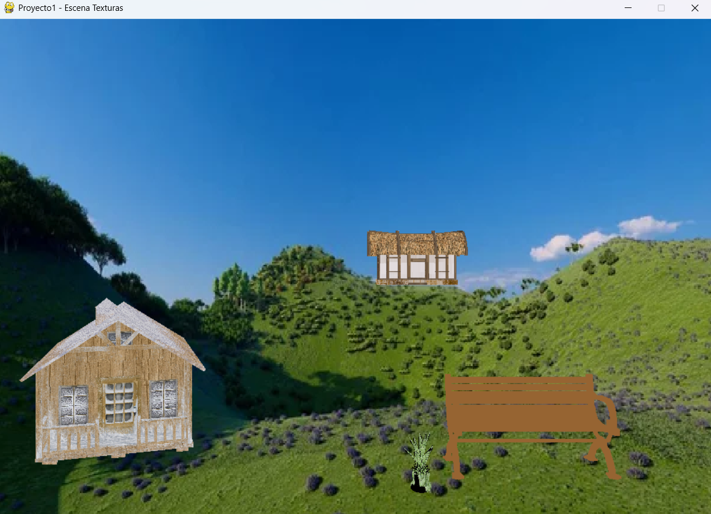
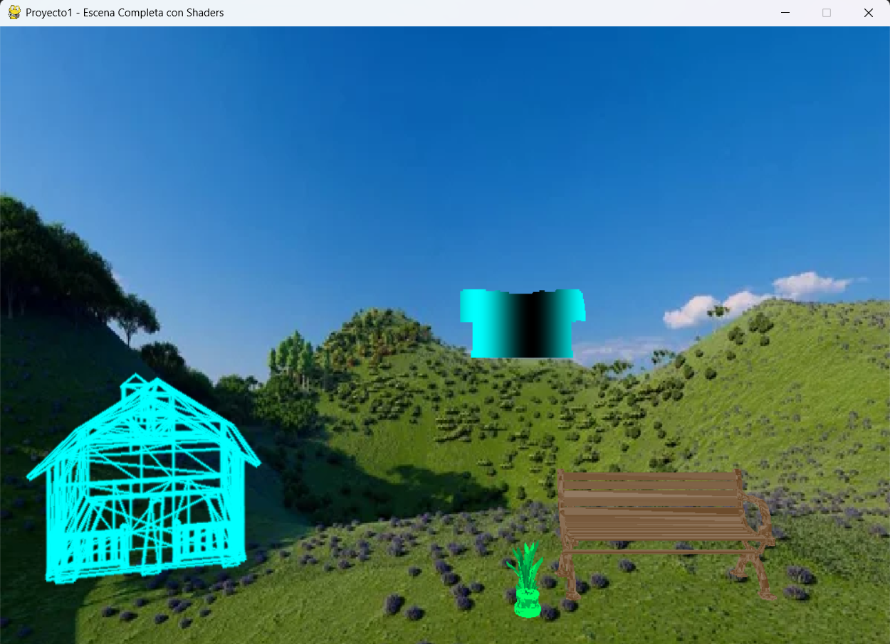

# Proyecto 1 - Graficación por Computadora

Este proyecto renderiza una escena 3D completa usando archivos `.obj`, texturas y shaders personalizados desarrollados en Python con Pygame y Numpy.

Se divide en dos implementaciones:

- `main_texturas.py`: renderiza la escena usando **texturas reales** y **z-buffer** para el correcto orden de dibujado.
- `main_shaders.py`: renderiza la escena aplicando **shaders personalizados** como CRT, glitch, ruido estático, gradientes y neón.

---

## 📸 Resultados

### Escena con Texturas

Esta versión utiliza mapas de textura para cada objeto. El z-buffer asegura que los objetos más cercanos se rendericen correctamente sobre los más lejanos.

---

### Escena con Shaders

Cada objeto tiene un shader visual aplicado:

- **Casa de madera**: shader CRT con líneas de escaneo.
- **Casita**: shader de neón con efecto glow.
- **Banca**: ruido estático estilo televisión vieja.
- **Planta**: shader de gradiente vertical con cambio de color.

---

## 🛠️ Requisitos

- Python 3.10 o superior (se ha probado con 3.13).
- `pygame`
- `numpy`

