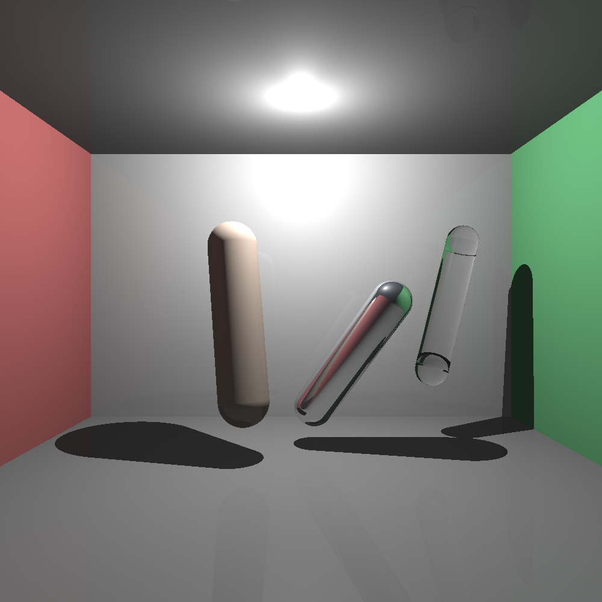

# Lab 8 – Ray Tracing: Figura Cápsula (50%)

---

##  ¿Qué pide el lab y cómo se cumple?

* **Implementar una figura distinta a las vistas en clase** → Se implementa **Cápsula** (`Capsula`).
* **Demostración**: Renderizar **3 veces** la figura con **diferentes tamaños, posiciones y materiales** → En la escena hay **tres cápsulas**:

  * **Mate (opaca)** – color arcilla claro.
  * **Reflectiva** – cromado azulado.
  * **Transparente** – vidrio con tinte verde agua.

---

## Algoritmo de Intersección Rayo–Cápsula

Una cápsula se modela como **cilindro finito** de radio *r* a lo largo del segmento **AB**, más **dos semiesferas** de radio *r* centradas en los extremos **A** y **B**.

## Creado por Diego Ramírez