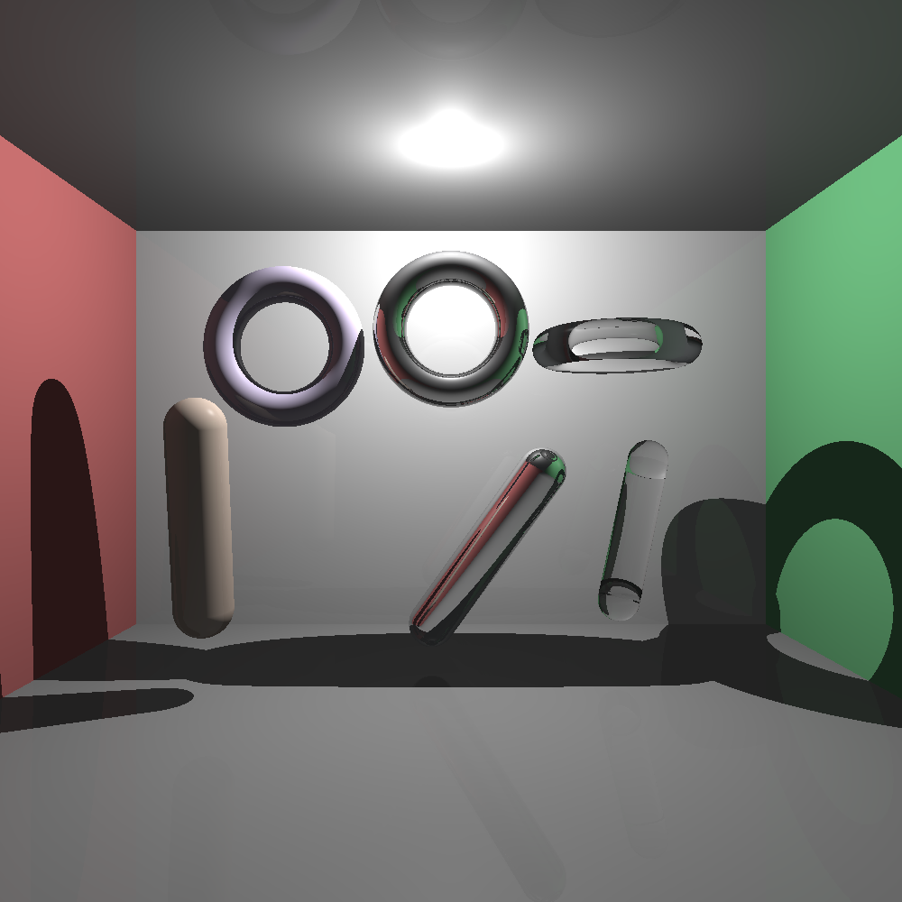

# Lab 8 – Ray Tracing: Cápsula + Toroide (100%)

---

## ✅ ¿Qué pide el lab y cómo se cumple?

* **Implementar dos figuras distintas a las vistas en clase** → Se implementan:
  * **Cápsula** (`Capsule`)
  * **Toroide** (`Torus`)

* **Demostración**: Renderizar **3 veces cada figura** con **diferentes tamaños, posiciones y materiales** → En la escena hay:
  * **Cápsulas:**
    * **Mate (opaca)** – tono arcilla claro.
    * **Reflectiva** – cromado azulado.
    * **Transparente** – vidrio con tinte verde agua.
  * **Toroides:**
    * **Mate (opaco)** – violeta suave.
    * **Reflectivo** – metálico pulido.
    * **Transparente** – vidrio claro con IOR.

---

## 📎 Autor
Creado por **Diego Ramírez**
