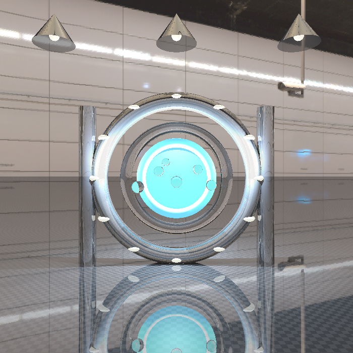
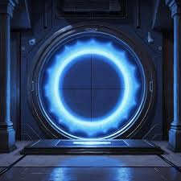

# 🌀 Proyecto 2 – Ray Tracer: Portal Sci-Fi

## 🧩 Descripción de la Escena

La escena representa un **portal energético** suspendido dentro de un laboratorio futurista.  
El portal está compuesto por varios anillos metálicos y luminosos, rodeado por luces, soportes estructurales y esferas de energía.

### Elementos principales:
- **Portal central:** Estructura de anillos concéntricos (toroides y disco energético) con materiales metálicos y translúcidos.
- **Soportes laterales:** Cilindros metálicos altos que enmarcan el portal.
- **Lámparas de techo:** Conos metálicos invertidos con luces cálidas direccionales (SpotLights) y bulbos emisivos.
- **Luces decorativas:** Elipsoides distribuidos en el contorno superior del portal simulando focos de energía.
- **Ondas de energía:** Esferas translúcidas dispersas frente al portal, representando pulsos energéticos.
- **Piso reflectivo:** Plano texturizado tipo checkerboard que refleja el portal.
- **Environment Map:** Imagen HDR (`metro.hdr`) utilizada para reflejos y fondo ambiental.

---

## ⚙️ Implementación Técnica

### Figuras Geométricas
Se utilizaron figuras básicas y figuras nuevas implementadas manualmente:

| Figura | Tipo |
|--------|------|
| Plano | Base (piso)
| Esfera | Base |
| Cilindro | Nueva |
| Cono | Nueva | 
| Toroide | Nueva |
| Elipsoides | Nueva |
| Disco de energia | Nueva |
 **Total de figuras en la escena:** más de 10  
 **Figuras nuevas implementadas:** 5 (Toroide, Cono, Elipsoide, Disco de energia, Cilindro)

---

### Materiales
Se utilizaron **4 materiales principales**, cada uno con propiedades únicas:

| Material | Descripción | Propiedades |
|-----------|--------------|--------------|
| `metal_dark` | Metal oscuro estructural | Reflección media, brillo alto |
| `metal_light` | Metal claro brillante | Reflejo intenso, alto especular |
| `glass_blue` | Material translúcido azulado | Refracción, transparencia alta |
| `floor_mat` | Textura tipo checker (piso) | Reflejos y textura procedural |

---

### Environment Map
- Archivo: `metro.hdr`  
- Funciona como entorno global y fuente de reflejos.  
- Considerado en la **reflexión y refracción** de los materiales.  

---

### Iluminación
Sistema de iluminación múltiple:

| Tipo | Cantidad | Descripción |
|------|-----------|-------------|
| **DirectionalLight** | 1 | Luz ambiental cálida general |
| **PointLight** | 4 | Luces de refuerzo alrededor del portal |
| **SpotLight** | 3 | Focos cálidos provenientes de las lámparas del techo |

 Además, se incluyen materiales **emisivos** para las luces visibles (bulbos, energía del portal, y elipsoides).

---

## Aspectos Técnicos Implementados
- **Ray Tracing completo** con reflexión y refracción.  
- **Cámara en perspectiva** con campo de visión configurable.  
- **Sombras reales** mediante rayos secundarios.  
- **Environment Mapping (HDR)** para reflejos y fondo.  
- **Iluminación múltiple:** Point, Spot y Directional lights.  
- **Texturas en el piso (procedural checker).**  
- **Materiales emisivos y brillantes.**

---

## Archivos Entregados
- `Pro2.py`  
- `metro.hdr` (Environment Map)  
- `render_proy2.png` (Render final)  
- `referencia.jpeg` (Referencia visual)  
- `README.md` (Este documento)

---

## 📸 Resultado
El render final muestra un portal de energía suspendido en un entorno metálico, iluminado por lámparas cálidas y reflejado sobre un piso pulido, logrando un efecto cinematográfico y coherente con la estética Sci-Fi.

---

## Creado por: Diego Ramírez

