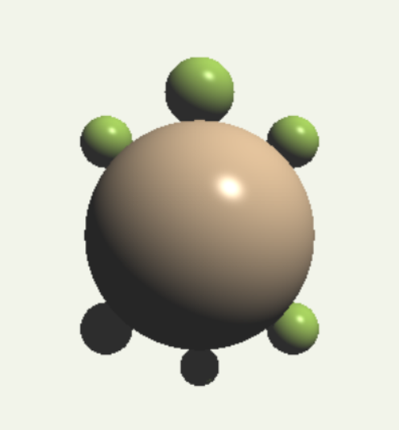

Ray Tracer – Tortuga (solo esferas)
===================================

Figura hecha únicamente con esferas y renderizada con ray tracing + iluminación Phong.
Visualización con pygame.

-----------------------------------

CÓMO EJECUTARLO
---------------
1) Guarda el script como:  Lab5.py
2) Ejecútalo:
   python Lab5.py

PARÁMETROS QUE CONTROLAN EL TAMAÑO
----------------------------------
En el archivo Lab5.py modifica estas constantes:

SCENE_SCALE = 0.60   # escala global (baja el valor para hacerlo más pequeño)
SCENE_Z     = -4.2   # distancia a la cámara (más negativo = más pequeño)
FOV_DEG     = 50     # campo de visión; más grande = se ve más área

-----------------------------------

¿CÓMO FUNCIONA EL RAY TRACER?
-----------------------------

1) Cámara y generación de rayos
   - La cámara está en el origen mirando a −Z.
   - Para cada píxel (x, y) se calcula un rayo que parte de la cámara hacia un plano
     de imagen a z = −1, usando el FOV para escalar las coordenadas.
   - La dirección del rayo se normaliza: d = normalize([px, py, −1]).

2) Intersección rayo–esfera
   - Esfera: centro c y radio r.
   - Rayo: o + t·d. Se resuelve ||o + t·d − c||^2 = r^2.
   - Se obtiene una cuadrática en t; se evalúa el discriminante Δ = b^2 − 4c.
     Si Δ < 0, no hay impacto. Si Δ ≥ 0, se toman las raíces positivas y se elige la más
     cercana. El punto de impacto es p = o + t·d y la normal n = normalize(p − c).

3) Iluminación (modelo Phong)
   Para cada luz y punto visible:
   - Ambiente:   ka * Ia
   - Difuso:     kd * max(0, L·N) * (Il * color_difuso)
   - Especular:  ks * max(0, R·V)^shininess * Il
   Donde:
   Ia = luz ambiente (blanca),
   Il = color/intensidad de la luz,
   L  = dirección del punto hacia la luz (unitaria),
   N  = normal de la superficie,
   R  = reflejo de L respecto a N,
   V  = dirección del punto hacia la cámara.

4) Sombras (shadow rays)
   - Desde el punto de impacto se lanza un rayo en la dirección L.
     Si algún objeto lo bloquea, el punto queda en sombra para esa luz
     y se omiten las componentes difusa y especular.

5) Ensamblado de la tortuga (solo esferas)
   - Caparazón: una esfera grande.
   - Cabeza, patas y cola : todas son esferas con diferentes radios.
   - Se usa SCENE_SCALE para escalar TODAS las posiciones y radios, y SCENE_Z
     para colocar la figura a la distancia correcta.
   - Una luz direccional (tipo “sol”) ilumina la escena.

6) Visualización con pygame
   - El ray tracer devuelve un arreglo numpy (H, W, 3) con colores uint8.
   - Se convierte a Surface con pygame.surfarray.make_surface y se muestra
     escalado a la ventana. El render es estático (una sola pasada).

-----------------------------------

ESTRUCTURA SUGERIDA
-------------------
/tu-proyecto
├── Lab5.py                (código principal)
├── tortuga.png            (imagen mostrada arriba en este README)
└── README.md              (este archivo)

COMPLEJIDAD
-----------
O(W × H × N), donde W y H son el tamaño de la imagen y N el número de esferas.

CREDITOS
-----------
Hecho por Diego Ramírez