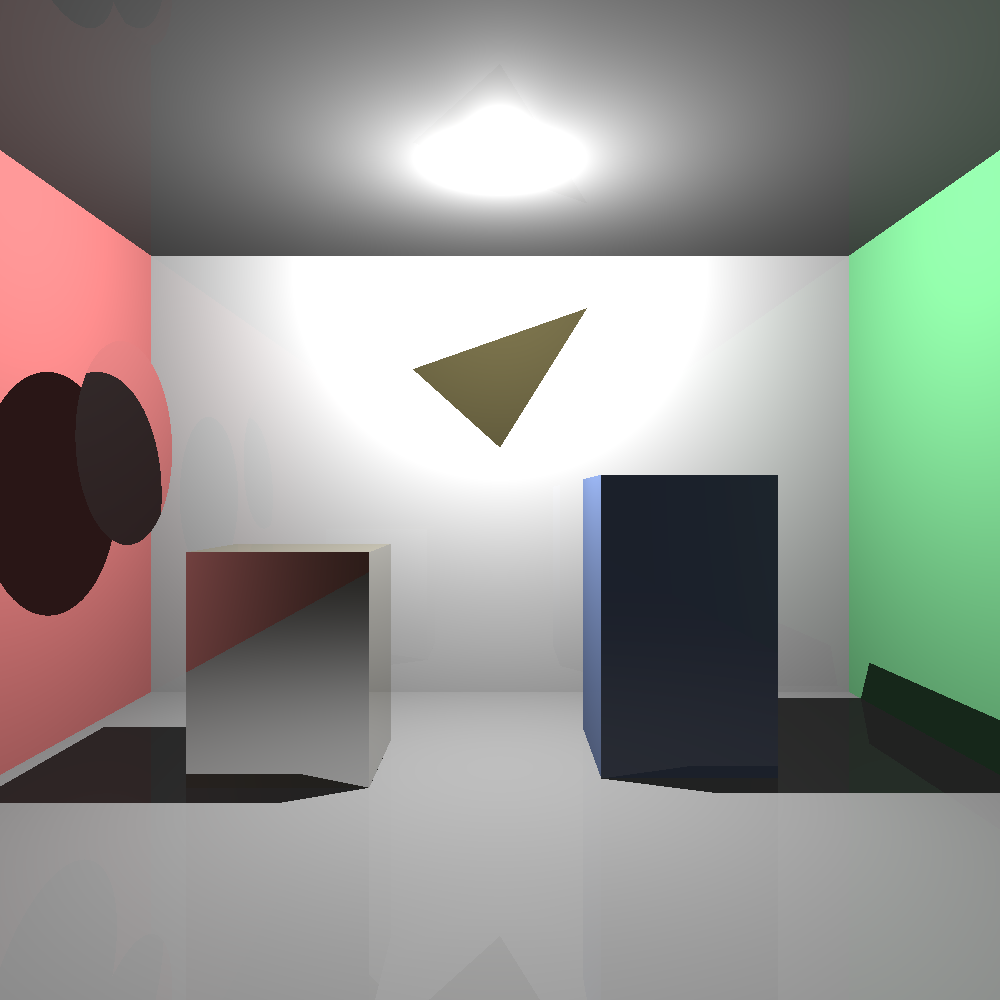

# Ray Tracer - Laboratorio 7

Este proyecto implementa un **ray tracer en Python** desde cero, capaz de renderizar escenas 3D con distintos materiales, sombras, reflexiones y transparencias.  

El objetivo fue construir un **cuarto cerrado** (estilo Cornell Box) y colocar figuras con materiales diferenciados para experimentar con el modelo de iluminación.

---

## Características

- **Primitivas soportadas**:
  - Planos (para paredes, piso y techo).
  - Cajas (cubos).
  - Triángulos.
  - Discos (para simular espejos o vidrios circulares).

- **Iluminación**:
  - Luces puntuales con atenuación cuadrática.
  - Modelo Phong (ambiental, difuso y especular).
  - Sombreados suaves con reflexión especular.

- **Materiales incluidos**:
  - **Difusos (mate)** → como paredes rojas, verdes y fondo blanco.
  - **Reflectivos (espejo)** → caja dorada reflectiva.
  - **Metálicos** → triángulo dorado metálico.
  - **Translúcidos (vidrio)** → disco de vidrio con transparencia y refracción.
  - **Mate coloreado** → caja azul.

- **Soporte para reflexión y refracción** (con coeficientes configurables).
- Render progresivo con **pygame** para vista previa.
- Exportación de la imagen final en `.png`.

## Creado por Diego Ramírez