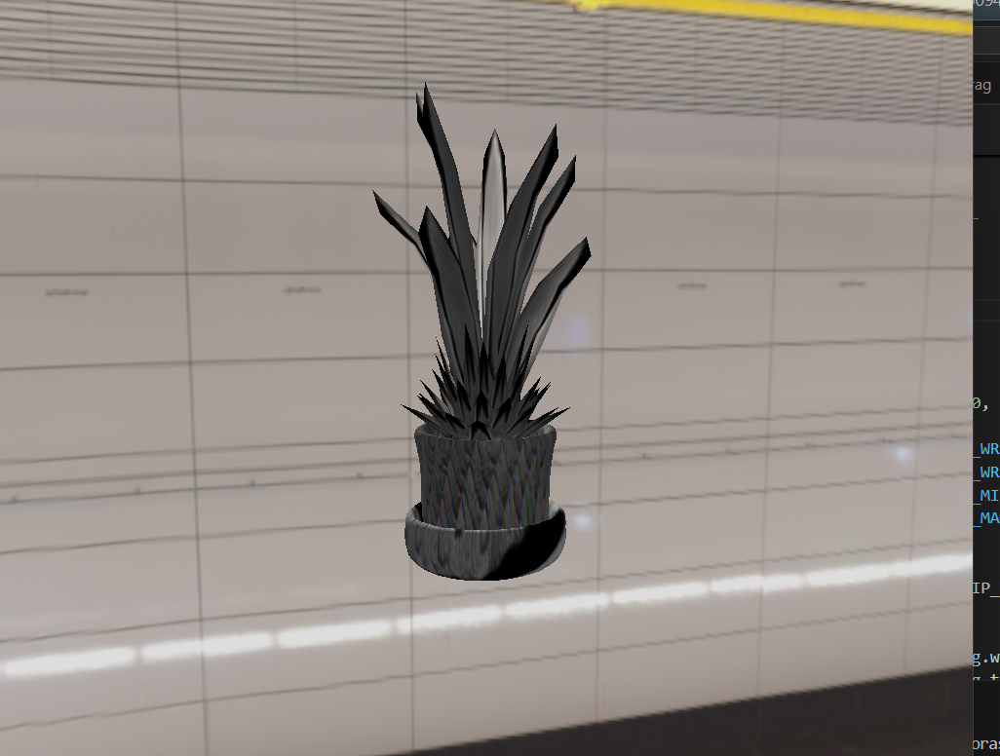
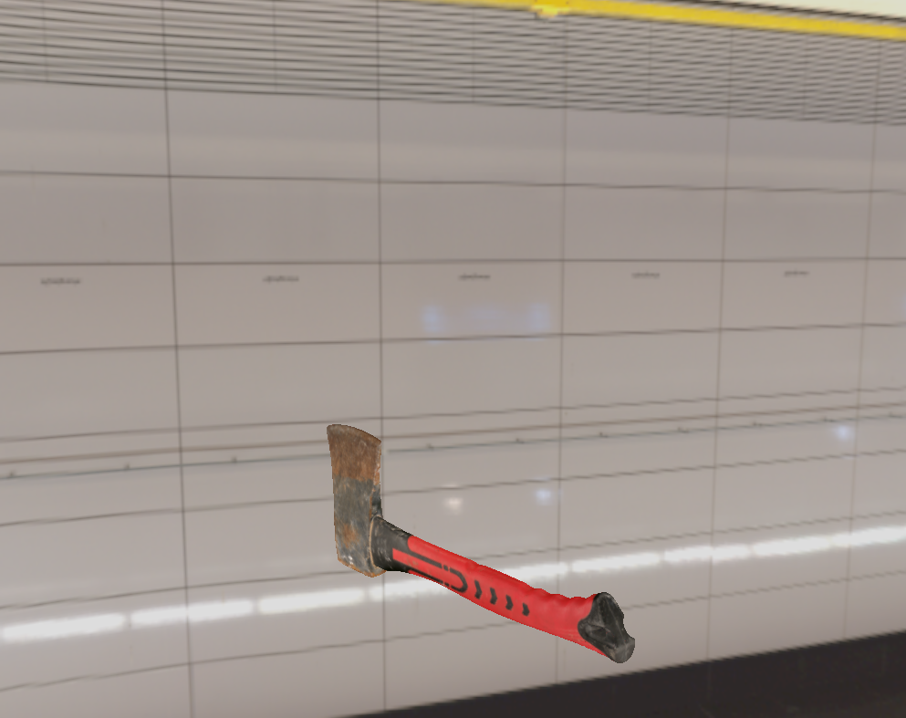
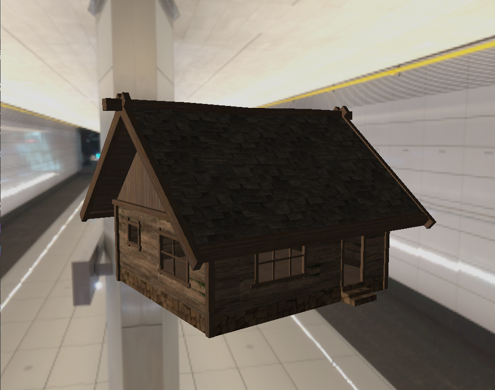
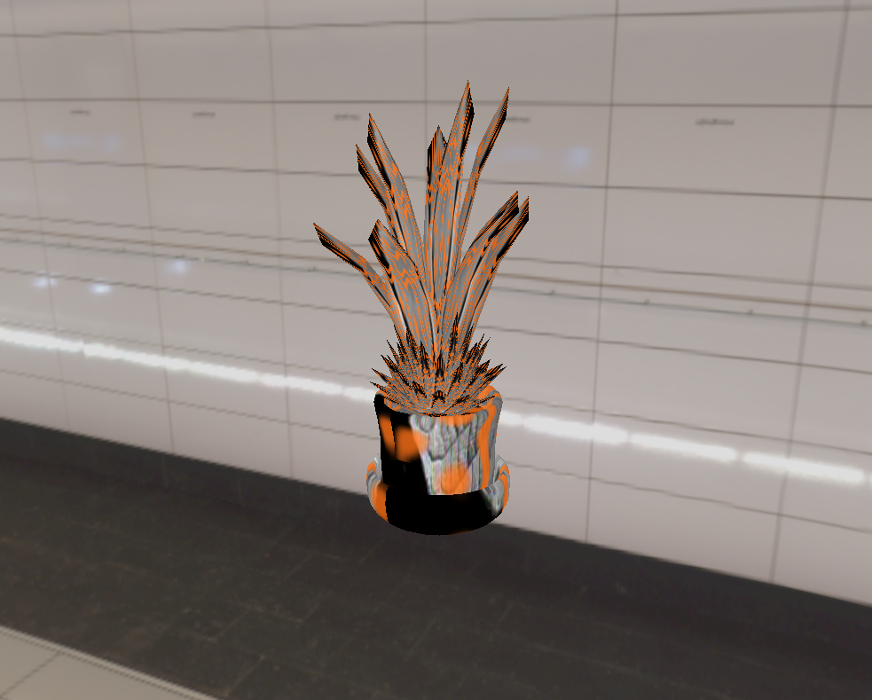
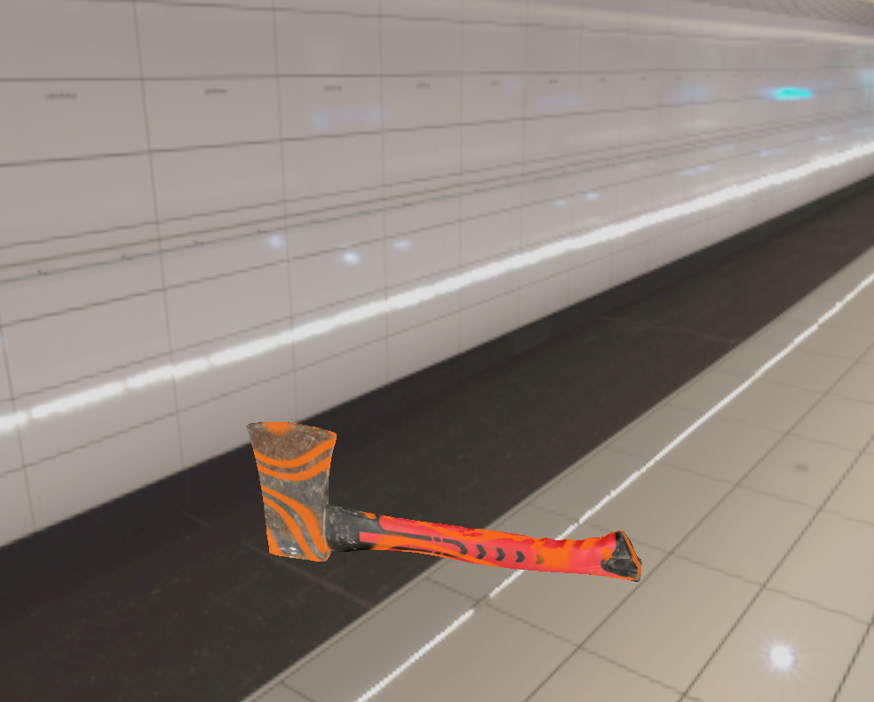
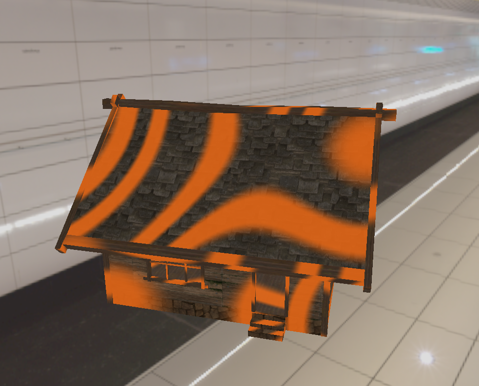

# README — Lab10 Visualizador 3D
El objetivo es implementar un visualizador de modelos 3D en OpenGL que permita:
- Cambiar entre tres modelos (`.obj`) texturizados.  
- Aplicar los shaders del laboratorio anterior (Wave, Glow, Twist, Pulse, Lava).  
- Renderizar un entorno (Skybox).  
- Controlar una cámara orbital con teclado y mouse.

---

## Modelos y Texturas

| Modelo | Archivo OBJ | Textura |
|---------|--------------|----------|
| Planta | `Planta.obj` | `planta.jpg` |
| Hacha | `Axe.obj` | `Axe_1.png` |
| Casa | `casa_madera.obj` | `casa_madera.png` |

- Todos los modelos se cargan con un loader OBJ que triangula automáticamente las caras.  
- Se escalan individualmente para mantener proporciones coherentes.  
- Cada modelo tiene su textura asignada.

---

## Entorno HDR — Skybox

- El entorno se genera a partir de la imagen HDR `metro.hdr`.  
- Se renderiza en un fullscreen pass reconstruyendo rayos de cámara.  
  - **Skymap:** fondo visual normalizado (HDR → LDR).  

### Shaders usados:
- `skybox_fullscreen.vert`  
- `skybox_fullscreen.frag`

El shader aplica tonemapping y corrección gamma para mostrar el rango HDR sin sobreexposición.

---

## Shaders combinables (Lab 9)

Los efectos del laboratorio anterior se integran al pipeline del visualizador.  
Cada uno puede activarse individualmente y combinarse con los demás.

| Shader | Tipo | Efecto | Tecla |
|--------|------|--------|-------|
| Wave | Vertex | Ondulación tipo viento | **4** |
| Glow | Fragment | Brillo cálido en contorno | **5** |
| Twist | Vertex | Retuerce el modelo sobre eje Y | **6** |
| Pulse | Vertex | Expansión rítmica (latido) | **7** |
| Lava Cracks | Fragment | Grietas incandescentes animadas | **8** |
| Reset | — | Desactiva todos los efectos | **9** |

Todos los efectos son combinables y adaptan su intensidad a la escala del modelo actual.

---

## Controles del Visualizador

| Acción | Entrada |
|---------|----------|
| Cambiar modelo | 1 → Planta / 2 → Hacha / 3 → Casa |
| Activar/Desactivar shader | 4–8 |
| Desactivar todos los shaders | 9 |
| Zoom In / Out | Q / E |
| Derecha / Izquierda | Mouse |
| Subir/Bajar cámara | Mouse |

---

## Cámara orbital
- Movimiento circular alrededor del modelo (`theta`, `phi`).  
- Limitación vertical (`phi ∈ [0.1, 1.3]`).  
- Zoom con límite de distancia (`radius ∈ [3.0, 15.0]`).  
- Siempre enfocado al centro del modelo.

---

## Resultado esperado

---

## Creado por: Diego Ramírez
